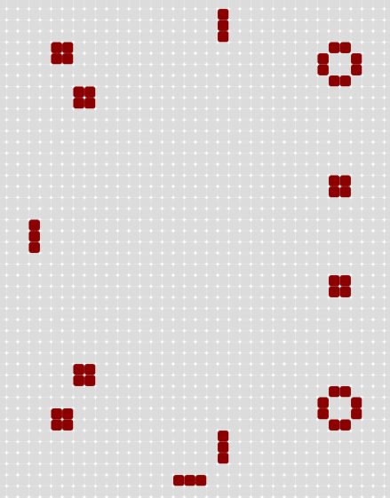
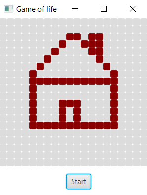

# Conway's Game Of Life

## Project description

Game of life is a project which implements basic main rules of [Conway's Game Of Life](https://en.wikipedia.org/wiki/Conway's_Game_of_Life).

## Showcase

### Choose pattern

You can choose one of the existing patterns below:

* Beacon 

 

* Blinker

 

* House

 

* Pentadecathlon

 

* Pulsar

 

* Toad

 

### Create pattern 

You can also create your own pattern and change the rules of the game.

 

## Contributors ✨

<table>
  <tr>
    <td align="center"><a href="https://github.com/alexmaz99"> <b>Aleksandra Mazur</b></a> </td>
  </tr>
</table>